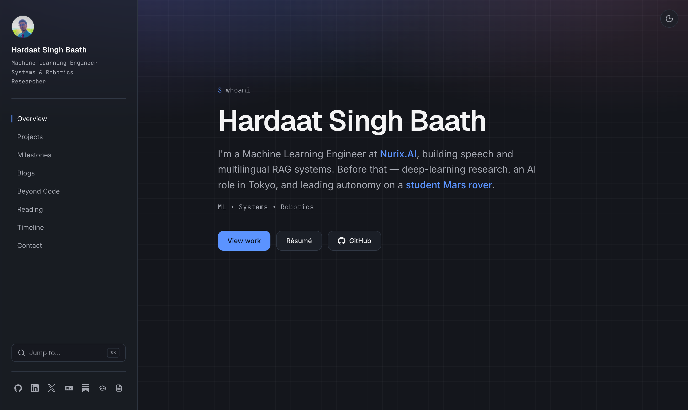
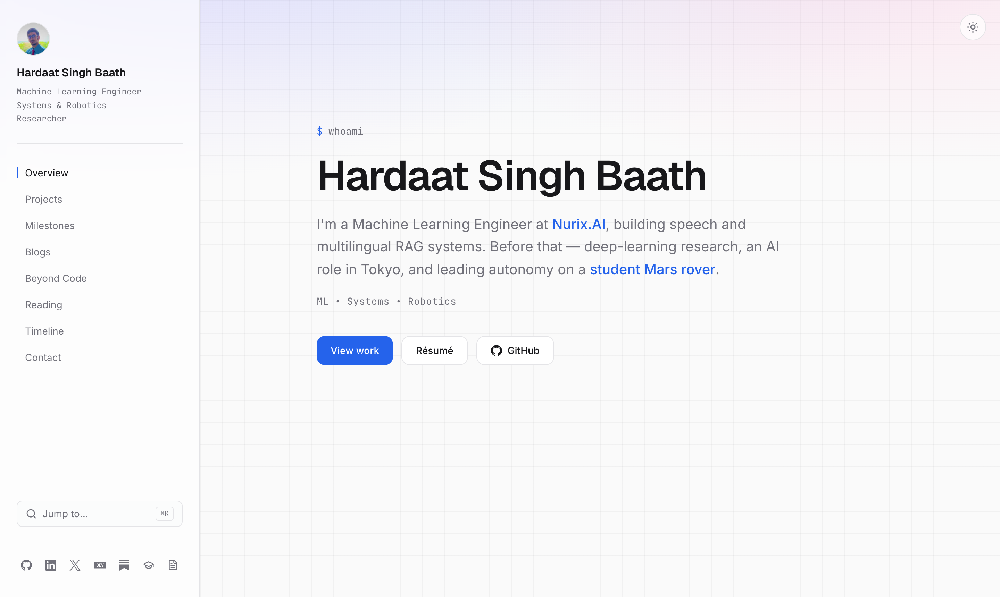

<div align="center">



# hardaatsinghbaath.com

**An engineer's workshop** — a calm, content-first personal site.
Single-page, persistent sidebar, dark-by-default, obsessively fast.

[](https://hardaatsinghbaath.com)
&nbsp;


</div>

---

## ✨ Highlights

- 🗂 **Single source of truth** — nearly all content lives in one [`site.config.ts`](./site.config.ts)
- 🌓 **Dark & light** — separate hand-tuned palettes, system-aware, one-tap toggle
- ⌘ **Command palette** (`⌘K` / `Ctrl+K`) + scroll-spy sidebar navigation
- 📝 **Self-updating writing** — latest posts auto-fetched from **dev.to** and **Substack** via ISR
- ✉️ **Contact form** over **Resend** — validated, honeypot-protected, recipient kept server-side
- ⚡ **Fast & discoverable** — static/ISR rendering, `sitemap.xml`, `robots.txt`, `Person` JSON-LD, analytics
- ♿ **Considered** — keyboard-navigable, visible focus, `prefers-reduced-motion` aware, zero layout shift

## 🖼 Preview

Light mode is a separately designed palette — not an inversion:



## 🛠 Built with

**Next.js 16** (App Router) · **React 19** · **TypeScript** · **Tailwind CSS v4** · **Framer Motion** · **Lucide** · **Resend** · deployed on **Vercel**

## 🚀 Run locally

```bash
npm install
cp .env.example .env.local   # then fill it in
npm run dev                  # http://localhost:3000
```

```bash
npm run build && npm run start   # production build
```

## ✏️ Editing content

<details>
<summary><b>Everything you'll want to change, and where</b></summary>

<br />

**Almost everything lives in one file: [`site.config.ts`](./site.config.ts).** Simple strings you might tweak without a code change (email, social handles, feed URLs) also read from environment variables — copy [`.env.example`](./.env.example) to `.env.local` and fill it in.

| I want to…                                    | Edit this                                                        |
| --------------------------------------------- | ---------------------------------------------------------------- |
| Change my name / hero tagline / roles         | `identity` in `site.config.ts`                                   |
| Change my email / social links / feed handles | `.env.local` (defaults live in `site.config.ts`)                 |
| Add / edit a **project**                      | `projects` array in `site.config.ts`                             |
| Change a project's **status badge**           | the project's `status` field (see options below)                |
| Projects shown before "More on GitHub"        | `featuredProjectCount` in `site.config.ts`                       |
| Edit **Accomplishments** / **timeline** / **reading** | `recognition` / `timeline` / `reading` in `site.config.ts`  |
| Reorder / rename the **sidebar nav**          | `nav` in `site.config.ts`                                        |
| Change a section's **heading / subtext**      | the `<SectionHeader />` in that section's file in `components/sections/` |
| Swap the résumé                               | replace the PDF in `public/`, set `NEXT_PUBLIC_RESUME_URL`       |

**Status badges:** `"Planning" | "Building" | "Testing" | "Research" | "Released" | "Archived"` — auto color-coded (blue = building/testing, green = research/released, muted = planning/archived).

**Blogs update themselves:** latest posts from dev.to (Blogs) and Substack (Beyond Code) are fetched automatically and refresh hourly — you never touch the code when you publish.

</details>

## 📦 Deploy & setup guides

Step-by-step docs live in [`docs/`](./docs):

1. [Deploy to Vercel](./docs/01-vercel-deploy.md)
2. [Buy & connect a custom domain](./docs/02-custom-domain.md)
3. [Wire up the contact form with Resend](./docs/03-resend-email.md)
4. [Google Analytics, Search Console & SEO](./docs/04-analytics-seo.md)

## 🧱 Project structure

```
site.config.ts          ← single source of truth for content
.env.example            ← configurable env vars, documented
app/
  layout.tsx            ← fonts, theme, metadata, JSON-LD, analytics
  page.tsx              ← assembles the sections (ISR)
  globals.css           ← design tokens (light + dark), scrollbar, selection
  sitemap.ts · robots.ts · icon.svg
components/
  navigation.tsx        ← sidebar + mobile drawer + scroll-spy
  command-palette.tsx   ← ⌘K quick jump
  sections/             ← hero, projects, recognition, writing, …
  ui/                   ← one card / button / badge design system
lib/posts.ts            ← dev.to + Substack fetchers (ISR)
actions/send-email.ts   ← Resend contact-form server action
```

## 🎨 Design language

Colors, `16px` radius, shadows, and fonts are CSS variables in `globals.css`. One card style, two button types, used everywhere. Animation is limited to fade, slide-up, and hover — nothing spins. Dark is the default; light is a separate palette, not an inversion.
