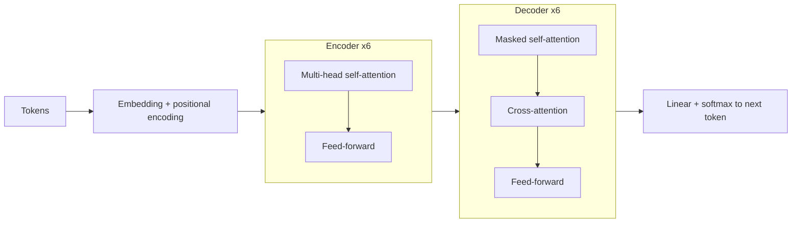

## 1. At a glance

**About.** RNN sequence models process tokens one at a time — inherently sequential,
so no within-example parallelism, and long-range dependencies decay. The
**Transformer** drops recurrence and convolutions and builds the model from
**attention** alone, so every position attends to every other in one parallel step.

**Used:** scaled dot-product **self-attention** · **multi-head** attention (h = 8) ·
**encoder–decoder** stack (N = 6 each) · **sinusoidal positional encodings** ·
position-wise **FFN** · residual + **LayerNorm**.

**Achieved ✓** — WMT-2014 SOTA: **28.4 BLEU** EN→DE (+2.0 over prior best), **41.8
BLEU** EN→FR, at a fraction of the training cost; base model trains in **12 h on 8
P100s**.

**Didn't ✗** — self-attention is **O(n²)** in sequence length (flagged for future
work); shown on translation/parsing only, not yet the general pretraining recipe
BERT/GPT would become.

## 2. Building blocks

> [!warning] Background — general knowledge, not paper claims

- **RNN / recurrence** — the prior default; step *t* depends on *t-1*, blocking
  parallelism and decaying long-range gradients. Removing it is the motivation.
- **Attention (Q/K/V)** — each token forms a **query**; every token exposes a **key**
  and **value**; output = value average weighted by query·key match.
- **Positional encoding** — attention is order-agnostic, so position is added back via
  fixed sinusoids.
- **Residual + LayerNorm** — `LayerNorm(x + Sublayer(x))`, standard deep-net stabilizer.
- **BLEU** — n-gram overlap translation metric; higher is better.

## 3. How it works

**Architecture**

**Core operation** — scaled dot-product attention:

$$
\text{Attention}(Q, K, V) = \text{softmax}\!\left(\frac{QK^{\top}}{\sqrt{d_k}}\right)V
$$

Steps — input → what they do → output:

1. **Embed + position** — token ids → `d_model = 512` vectors + sinusoidal positions.
2. **Encoder (×6)** — multi-head self-attention → FFN (residual+LayerNorm); every
   token gathers context from all source tokens.
3. **Decoder (×6)** — masked self-attention (no peeking ahead) → cross-attention over
   the encoder → FFN.
4. **Project** — linear + softmax over the vocabulary → next token.

> [!key] Ground reality
> Three details make "just attention" work: **√dₖ scaling** (large `d_k` flatlines
> softmax gradients), **multi-head** (8 heads track different relations at once), and
> the decoder **causal mask** (parallel training that's still autoregressive).

## 4. Results & conclusions

| Task (WMT-2014) | Model | BLEU |
| --- | --- | --- |
| EN→DE | Transformer (big) | **28.4** (prior ensemble 26.36) |
| EN→FR | Transformer (big) | **41.8** |

**Conclusion (authors).** Attention + FFN blocks match or beat recurrent/convolutional
models while being far more parallelisable — the architecture the field built on since.

## 5. Questions worth asking

- How far can sequence length scale before O(n²) attention dominates?
- How much of the win is attention vs. simply removing the sequential bottleneck?
- Sinusoidal vs. learned vs. rotary positions — which matters, and when does
  length-extrapolation break?
- Shared backbone of [[retrieval-augmented-generation]] and
  [[moshi-speech-text-foundation-model]] — what changes when "tokens" are passages or audio?
