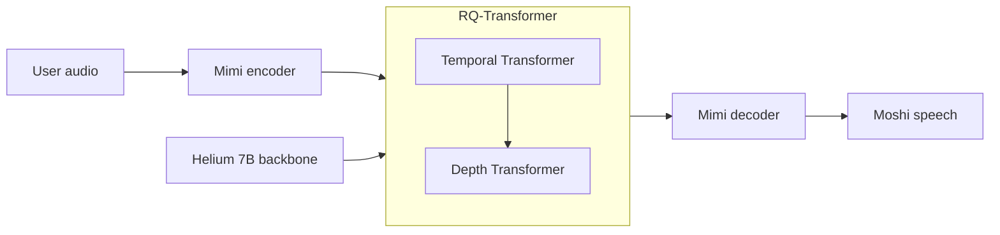
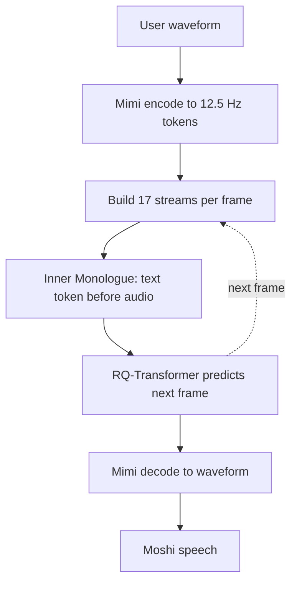

## 1. At a glance

**About.** Voice assistants normally chain VAD → ASR → text LLM → TTS, which is
slow, discards tone, and forces rigid turns. Moshi replaces the chain with a single
**speech-to-speech** model that listens and speaks at once (full-duplex), in real time.

**Used:** **Mimi** (neural audio codec) · **WavLM** (semantic distillation) ·
**Helium** (7B Transformer LM) · **RQ-Transformer** (decoder) · **Inner Monologue**
(text-before-audio).

**Achieved ✓** — first real-time full-duplex spoken LLM; **160 ms** theoretical /
**200 ms** practical latency; handles overlap/interruptions with no turn
segmentation; preserves non-linguistic signal; free streaming ASR/TTS.

**Didn't ✗** — English-only backbone; single trained voice (not zero-shot cloning);
1.1 kbps audio trades fidelity for latency; noisy/far-field robustness not established.

## 2. Building blocks

> [!warning] Background — general knowledge, not paper claims
> Just enough to read §3.

- **Neural audio codec + RVQ** — compresses a waveform into discrete tokens and
  back. Residual Vector Quantization stacks codebooks, each correcting the previous
  one's error. Letting an LLM predict these tokens is how it "speaks."
- **Mimi** (this paper) — causal/streaming codec at **12.5 Hz, 1.1 kbps, 8
  codebooks**; codebook 1 carries *semantic* content, codebooks 2–8 carry *acoustic*.
- **WavLM** — self-supervised speech encoder; distilled into Mimi's first token so it
  encodes *meaning*, not just sound.
- **Helium** — Kyutai's **7B** Transformer LM (RoPE, RMSNorm, FlashAttention;
  2.1T English tokens), same core as [[attention-is-all-you-need]]; supplies reasoning.
- **Full-duplex** — both sides transmit at once, so the model must keep modelling the
  user's audio while generating its own.

## 3. How it works

**Architecture**



**Complete flow**



**Big idea.** Model the conversation as one token stream containing *both* speakers;
if the model always predicts the user's stream too, it is inherently full-duplex.

Each 12.5 Hz frame carries **K = 17 sub-streams**:

```text
[ 1 text ] + [ 8 audio: Moshi ] + [ 8 audio: user ]
             └── acoustic delay τ = 1 step ──┘
```

Steps — input → what they do → output:

1. **Encode** — waveform → Mimi → 1 semantic + 7 acoustic tokens per frame.
2. **Stream layout** — stack Moshi audio + user audio + text into the 17 sub-streams.
3. **Inner Monologue** — emit the frame's aligned **text token before** its audio
   tokens (text aligned to 12.5 Hz via Whisper timestamps, PAD/EPAD between words).
4. **Generate** — the **Temporal** Transformer runs across time steps; the small
   **Depth** Transformer predicts the 17 tokens within a step.
5. **Decode** — Mimi decodes Moshi's audio tokens back to a streaming waveform.

> [!key] Ground reality
> Three tricks make it work: semantic-token **distillation** (audio tokens carry
> meaning), the **acoustic delay τ = 1** between text and audio (stabilizes
> generation), and **Inner Monologue** (text-before-audio, which lifts linguistic
> quality).

## 4. Results & conclusions

| Aspect | Reported |
| --- | --- |
| Latency | **160 ms** theoretical, **200 ms** practical |
| Helium (text) | 79.6% ARC-easy · 54.3% MMLU |
| Spoken QA | Authors claim SOTA among speech-text models |
| Release | Code + weights at `github.com/kyutai-labs/moshi` |

**Conclusion (authors).** A single generative model over audio tokens does real-time,
full-duplex spoken dialogue end-to-end; the semantic/acoustic split and Inner
Monologue keep quality high at very low bitrate.

## 5. Questions worth asking

- How much of the quality is Helium's 7B prior vs. the audio modelling?
- The 200 ms is model latency — where does real product latency land?
- How robust is 1.1 kbps Mimi to noisy / far-field / multi-speaker input?
- How brittle is Inner Monologue to Whisper timestamp errors?
- Is "knowledge in the tokens" here at odds with external memory like
  [[retrieval-augmented-generation]]?
