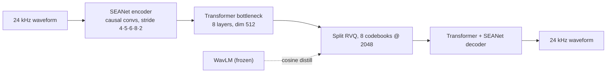
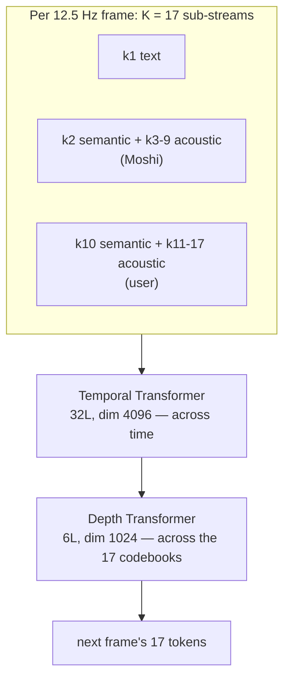
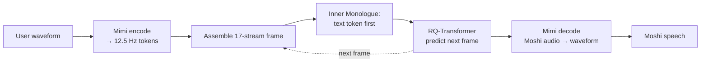
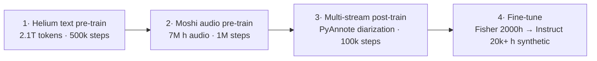

## 1. At a glance

**About.** Voice assistants normally chain VAD → ASR → text LLM → TTS: high latency,
tone/emotion discarded, rigid turn-taking. Moshi replaces the chain with a single
**speech-to-speech** model that speaks *and* listens simultaneously (full-duplex) in
real time, by generating discrete audio-codec tokens with a text-LLM backbone.

**Used:** **Mimi** codec · **WavLM** (semantic distillation) · **Helium** 7B LM ·
**RQ-Transformer** (Temporal + Depth) · multi-stream modeling · **Inner Monologue**.

**Achieved ✓** — first real-time full-duplex spoken LLM; **160 ms** theoretical /
**200 ms** practical latency; no turn segmentation (handles overlap/interruptions);
preserves emotion/non-speech sound; the same model does streaming ASR and TTS by
changing one delay; code + weights released (`kyutai-labs/moshi`).

**Didn't ✗** — English-only; single fixed voice (not zero-shot cloning); 1.1 kbps
audio (fidelity traded for latency); streaming ASR/TTS needs speaker-separated audio;
trained on 5-min context (long-conversation scaling unclear); artifacts on repetitive
text and poor input audio.

## 2. Building blocks

> [!warning] Background — general knowledge, not paper claims

- **Neural audio codec + RVQ** — turns a waveform into discrete tokens and back.
  Residual Vector Quantization stacks codebooks, each quantizing the previous one's
  residual; more codebooks = higher fidelity. An LLM "speaks" by predicting these tokens.
- **Semantic vs. acoustic tokens** — *semantic* tokens capture *what was said*
  (phonetic/linguistic); *acoustic* tokens capture *how it sounds* (timbre, prosody).
- **WavLM** — a self-supervised speech encoder whose features carry linguistic content.
- **SEANet** — the convolutional encoder/decoder backbone used by codecs like EnCodec.
- **Transformer / Helium** — standard attention LM ([[attention-is-all-you-need]]);
  here the reasoning backbone that emits audio tokens.
- **Full-duplex** — both sides transmit at once, so the model must model the user's
  audio while generating its own.

## 3. Architecture & method

**Big idea.** Model the conversation as **one token stream containing both speakers**,
generated frame-by-frame by an LLM over Mimi tokens. Always predicting the user's
stream too makes it inherently full-duplex — no turn logic.

### 3a. Mimi — the audio codec



- **Rate/bitrate:** 24 kHz in, **12.5 Hz** token rate, **1.1 kbps**, latent dim 512
  (projected 512→256 before RVQ). Encoder strides (4, 5, 6, 8) + a final stride-2 conv.
- **Transformer bottleneck:** two modules (before & after quantization) — 8 layers, 8
  heads, RoPE, GELU, dim 512, MLP 2048, causal, 250-frame (20 s) context, LayerScale 0.01.
- **Split RVQ:** codebook 1 is a plain VQ carrying **semantic** content; codebooks 2–8
  are a 7-level RVQ on the residual carrying **acoustic** detail; outputs summed. This
  split is what lets one token stream be both meaningful and reconstructable.
- **Semantic distillation:** WavLM embeds 16 kHz audio → 1024-d @ 50 Hz; average-pooled
  (kernel 8, stride 4) to 12.5 Hz; a linear projection of codebook-1's output is trained
  to match it by **cosine distance**.
- **Losses:** final recipe is **adversarial-only** — a multi-scale STFT discriminator +
  feature loss, **no reconstruction loss** (subjectively better audio despite worse
  objective metrics), plus the distillation loss on codebook 1.
- **Training tricks:** quantize only **50 % of the time** (per-sequence; else pass
  unquantized latents to the decoder); **quantizer dropout** for bitrate scalability;
  weight decay 5·10⁻² on Transformer params only.
- **Streaming:** fully causal; **80 ms** initial frame/stride latency.
- **Codec training:** AdamW, lr 8·10⁻⁴, batch 128, 12-s windows, **4M steps**, EMA 0.99.

### 3b. Helium — the text backbone

**7B** params: 32 layers, dim 4096, 32 heads, 4096 context; RMSNorm, RoPE, **GLU+SiLU**
FFN, FlashAttention. Tokenizer: 32k **SentencePiece** unigram (digits split, byte-backoff).

### 3c. Moshi — multi-stream generation



Moshi jointly models **three streams**: its own **text** (aligned words), its own
**audio** (semantic + acoustic), and the **user's audio** — packed into **K = 17
sub-streams per frame** (k1 text; k2 + k3–9 Moshi audio; k10 + k11–17 user audio):

```text
[ k1 text ] [ k2 sem | k3..k9 acoustic  → Moshi ] [ k10 sem | k11..k17 acoustic → user ]
                       └── acoustic delay τ = 1–2 steps ──┘
```

- **RQ-Transformer.** A large **Temporal Transformer** (32L, 4096, 32 heads) runs across
  time and emits a context vector zₛ per frame; a small **Depth Transformer** (6L, 1024,
  16 heads, **per-codebook parameters**) then predicts the 17 tokens *within* the frame,
  each conditioned on zₛ and the earlier codebooks. This factorization keeps per-step
  cost low.
- **Acoustic delay.** Delaying acoustic tokens by **τ = 1–2** steps behind the semantic
  token cuts intra-frame dependencies → more stable generation and a smaller Depth model.
- **Inner Monologue.** Moshi's audio is transcribed with **Whisper**, tokenized, and
  aligned to the 12.5 Hz grid by word timestamps: **EPAD** at position tᵢ−1, the word's
  tokens at tᵢ…, **PAD** filling gaps. The text token for a frame is generated **before**
  its audio tokens, so language competence guides speech.

> [!key] ASR and TTS fall out of one delay δ
> Varying the text↔audio delay needs no change to loss/architecture/data: **δ = 0** =
> dialogue; **δ > 0** = text leads → **TTS**; **δ < 0** with ground-truth audio tokens,
> sampling only text → streaming **ASR**.

### 3d. Full inference flow



## 4. Training & data



1. **Helium text pre-training** — **2.1T tokens**: 12.5 % curated (Wikipedia 2017–2022,
   Wikibooks/Source/News, StackExchange, peS2o) + 87.5 % CommonCrawl (10 crawls); dedup
   (FNV-1a + fuzzy), fastText language ID (>0.85) + quality filter. 500k steps, batch
   4.2M tokens, AdamW lr 3·10⁻⁴ cosine.
2. **Moshi audio pre-training (single stream)** — **7M hours** of mostly-English audio,
   transcribed with **Whisper large-v3**. 1M steps, batch ≈ 16 h audio, 5-min sequences,
   lr 3·10⁻⁵ (Temporal) / 2·10⁻⁴ (Depth); **half the batches are text-only** to prevent
   catastrophic forgetting.
3. **Multi-stream post-training** — same corpus, **PyAnnote** diarization: pick one
   speaker as "main", derive a binary mask to split main vs. other stream. 100k steps,
   batch ≈ 8 h, lr 3·10⁻⁶ / 5·10⁻⁵.
4. **Fine-tuning** — **Fisher** (2000 h real 2-channel phone calls; 10k steps), then an
   **instruct** set: **20k+ hours of synthetic dialogue** — transcripts generated by
   Helium (fine-tuned on Open Hermes + real transcripts), spoken by a **multi-stream
   streaming TTS** with a **single actor voice** across 70+ styles; covers knowledge,
   emotion/voice control, and safety refusals. 30k steps, batch ≈ 2.7 h, lr 2·10⁻⁶.

- **Loss weighting:** text (k1) weighted equal to all audio combined; **semantic token
  αₖ = 100**, acoustic αₖ = 1 (semantics dominate).
- **User-stream augmentation:** random gain (−24→+15 dB, 50 %), noise (30 %), echo
  (30 %), reverb (30 %).
- **Compute:** H100 GPUs, FSDP + activation checkpointing; AdamW, wd 0.1, β = (0.9, 0.95).

## 5. Results, ablations & limitations

**Helium text** (Table 2): MMLU **54.3** · ARC-e **79.6** · ARC-c **55.9** · HellaSwag
**76.3** · OpenBookQA **53.6** · WinoGrande **70.0** · PIQA **79.4** — on par with
Llama 2 / MPT / Falcon; below Mistral & Gemma on MMLU.

**Speech / dialogue.** Semantic-token phonetic discriminability measured by **ABX**;
adversarial-only Mimi gives a large subjective quality gain. **Spoken QA** on Web
Questions, Llama Questions, and spoken TriviaQA — authors claim **SOTA among
speech-text models**. Latency **160 ms** theoretical / **200 ms** practical.

**Ablations.** **Inner Monologue** is among the most critical factors for speech
quality; **acoustic delay** (1–2 steps) markedly improves generation; **split RVQ**
improves the semantic/acoustic trade-off; **per-codebook** Depth params help;
**quantizer dropout** improves objective metrics at low bitrate (human eval inconclusive).

**Safety.** Toxicity and **regurgitation/memorization** analyses (effect of fine-tuning);
the single-actor voice makes it consistently one identity (hard to impersonate others);
**audio watermarking** explored (signal-based + generative).

**Limitations (authors).** Streaming ASR/TTS requires a forced text-audio delay and
speaker-separated audio; artifacts on repetitive text, silence-vs-noise, and poor input
audio; 5-min training context (long-conversation scaling open); English-only.

## 6. Questions worth asking

- How much of dialogue quality is Helium's 7B prior vs. the audio modeling — how far can
  the backbone shrink?
- The 200 ms is *model* latency; where does real product latency (network, endpointing,
  buffering) land?
- How robust is 1.1 kbps Mimi to noisy / far-field / multi-speaker input beyond augmentation?
- Instruct data is 20k+ h of *synthetic* single-voice speech — how much does that cap
  naturalness and voice diversity?
- Is "knowledge in the audio tokens" here complementary to, or at odds with, external
  memory like [[retrieval-augmented-generation]]?
