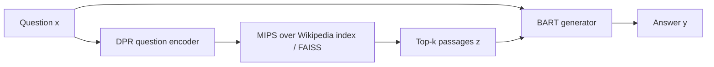

## 1. At a glance

**About.** LLMs store facts in their weights, which is hard to update, hard to
attribute, and prone to hallucination. **RAG** adds a second memory — a searchable
document index — and conditions generation on retrieved passages, so facts live in an
index you can swap out.

**Used:** **BART-large** (400M) generator · **DPR** dual-BERT retriever · **Wikipedia
index** (21M passages, MIPS via FAISS) · two variants **RAG-Sequence** / **RAG-Token**.

**Achieved ✓** — open-domain QA SOTA (e.g. **Natural Questions 44.5 EM** vs DPR's
41.5), trained end-to-end with **no gold-document supervision**; more factual/specific
generation (Jeopardy: judged factual **42.7%** vs BART **7.1%**); knowledge editable
by swapping the index.

**Didn't ✗** — bottlenecked by **retrieval** (missed passage → unrecoverable); the
**document encoder is frozen** to avoid re-indexing 21M passages; competitive but not
universally SOTA (near DPR on TriviaQA).

## 2. Building blocks

> [!warning] Background — general knowledge, not paper claims

- **Parametric vs. non-parametric memory** — knowledge in weights (fluent, static,
  opaque) vs. an external index (editable, attributable). RAG combines both.
- **BART** — Transformer encoder-decoder ([[attention-is-all-you-need]]) pretrained as
  a denoiser; writes the answer given query + retrieved text.
- **DPR** — two BERT encoders (question / passage) into a shared space; relevant pairs
  have high inner product. Semantic search, not keyword (BM25).
- **MIPS / FAISS** — Maximum Inner-Product Search finds nearest passage vectors;
  FAISS makes it fast/approximate over 21M passages.

## 3. How it works

**Flow**

**Big idea.** Treat the retrieved document $z$ as a **latent variable**, marginalise
over the top-k, and train retriever + generator jointly on just the final answer.

$$
p_{\text{RAG-Seq}}(y\mid x) \approx \sum_{z\in\text{top-}k} p_\eta(z\mid x)\,p_\theta(y\mid x,z)
\quad
p_{\text{RAG-Tok}}(y\mid x) \approx \prod_i \sum_{z\in\text{top-}k} p_\eta(z\mid x)\,p_\theta(y_i\mid x,z,y_{<i})
$$

Steps — input → what they do → output:

1. **Encode query** — question → DPR question encoder → dense vector.
2. **Retrieve** — MIPS over the pre-encoded Wikipedia index → top-k passages.
3. **Generate** — BART conditions on query + passages → answer.
4. **Marginalise** — **RAG-Sequence** uses one document for the whole answer;
   **RAG-Token** can use a different document per token.

> [!key] Ground reality
> "Train end-to-end" hides the compromise: back-prop into the document encoder would
> require re-indexing all 21M passages every step, so they **freeze the document
> encoder** and fine-tune only the query encoder + generator.

## 4. Results & conclusions

- **Natural Questions:** RAG-Sequence **44.5 EM** vs DPR 41.5 — SOTA at the time; also
  new SOTA on other open-domain QA benchmarks (exact per-dataset figures vary by
  metric — verify against Table 1 before quoting).
- **Generation:** markedly more factual/specific than BART (Jeopardy, human eval).

**Conclusion (authors).** Combining parametric (BART) and non-parametric (Wikipedia)
memory, trained end-to-end, beats closed-book models on knowledge-intensive tasks
while making knowledge updatable and answers grounded.

## 5. Questions worth asking

- How much do better retrievers (hard negatives, joint training) close the gap vs. the
  frozen-index compromise?
- RAG-Token vs. RAG-Sequence — when is per-token switching worth the cost?
- Does retrieval still help once the generator is a modern large LLM?
- Contrast "knowledge in an editable index" here with "knowledge in the audio tokens"
  in [[moshi-speech-text-foundation-model]].
